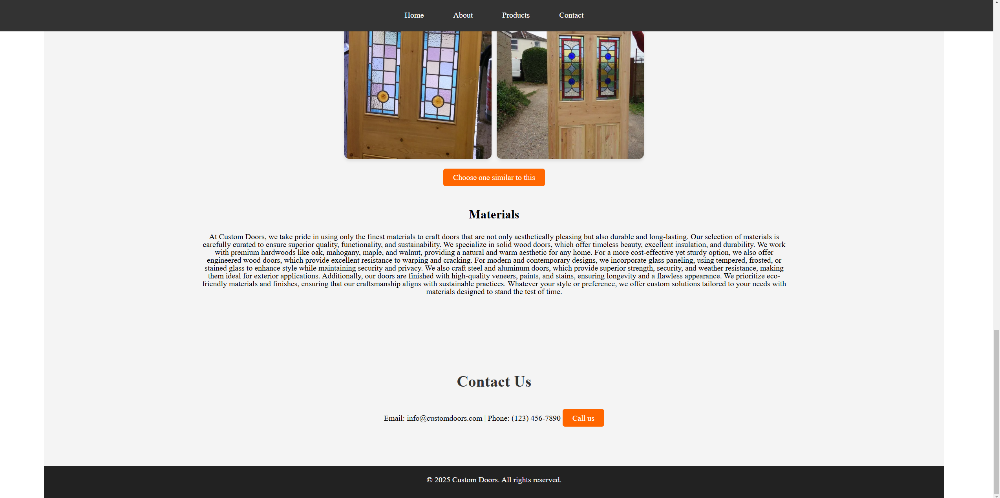
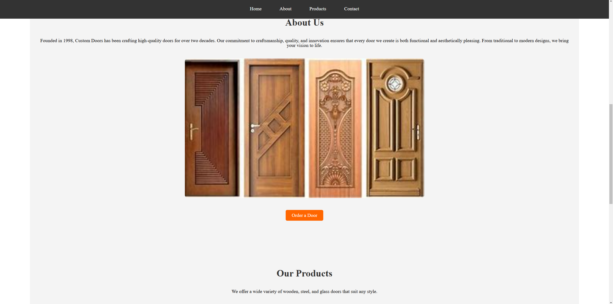
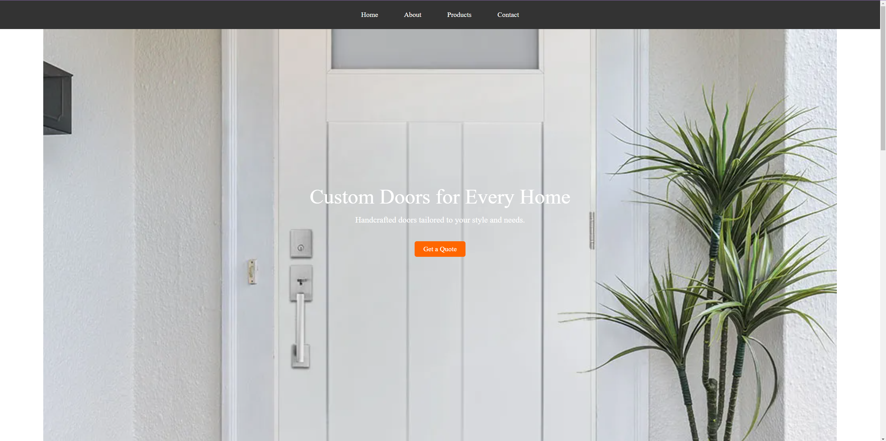

# Lab 2 - Landing page

by Gavriliuc Tudor - FAF-221

## Project Overview
Create a web page for your/friends/relatives business (example: car-rent, cookies-shop, crypto-scam)

## Features

- Navigation Bar – Smooth access to sections.

- Hero Section – Engaging welcome with a CTA.

- About Us – Company history and mission.

- Product Gallery – Showcase of door designs.

- Materials Used – Information on premium materials.

- Contact Section – Easy-to-find details.

## Technologies Used
- **HTML5** for page structure
- **CSS3** for styling
- **Git & GitHub** for version control
- **GitHub pages** for hosting

## Screenshots

## Live Demo
[View the deployed project here](https://tudor-gavriliuc.github.io/tum-web-lab2/)
